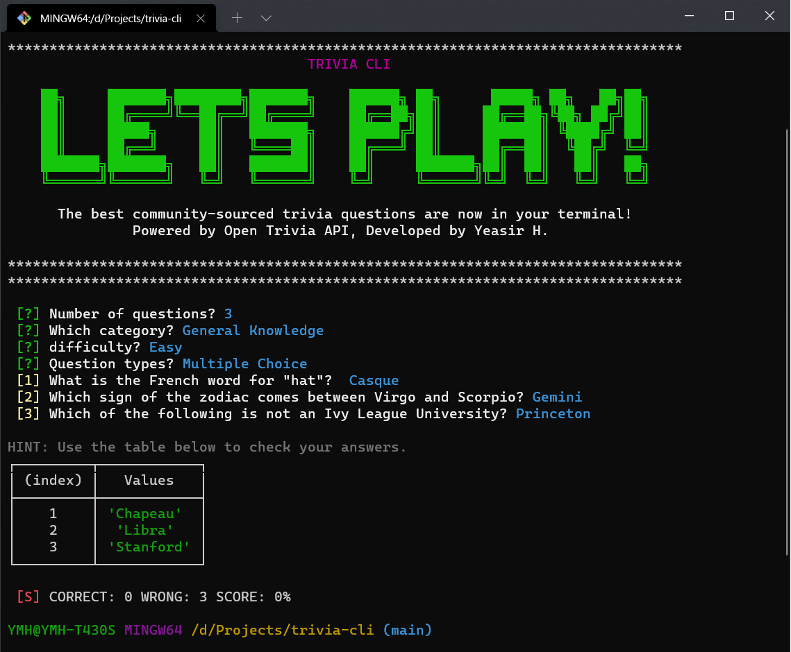

<!-- https://img.shields.io/apm/l/trivia-cli -->

<p align="center">
    
</p>


# Trivia-CLI |
Welcome to Trivia-CLI, a command-line-based quiz game that will test your knowledge on various topics! This simple yet engaging game allows you to configure your quiz preferences, answer questions, and see how well you score. Challenge yourself or compete with friends to see who can achieve the highest score!

## ⚙️ Play Options
* **Number of Questions (1-50):**
Choose the number of questions you want to answer in the quiz.
* **Categories (24+ to choose from):**
Select a category that interests you. Whether it's science, history, or general knowledge, there's something for everyone.
* **Difficulty (easy, medium, hard):**
Adjust the difficulty level of the questions based on your comfort and expertise.
* **Type (Multiple Choice or True/False):**
Decide whether you prefer multiple-choice questions or true/false questions.

## 📸 Screenshot


## 🎮 Gameplay
Once you've configured your preferences, the game will begin. Answer each question to the best of your ability. After completing the quiz, a table will be displayed showing the correct answers and your final score.

## 📦 Dependencies & Requirements
- Node 17.4+
- NPM or Yarn Package Manager 8.4+
- Internet Connection (API)

## 🚩 Getting Started
For NPM
```
$ npm install -g yeasir01/trivia-cli
```
For Yarn
```
$ yarn global add https://github.com/yeasir01/trivia-cli
```

Then from any command line interface...

```
$ quiz or trivia-cli
```

## ⭐ Credits
[OpenTrivia API](https://opentdb.com/) Free to use, user-contributed trivia question database.

## ⚖️ License
This project is licensed under the MIT License - see the LICENSE file for details.
Have fun playing Trivia-CLI, and may your knowledge shine!